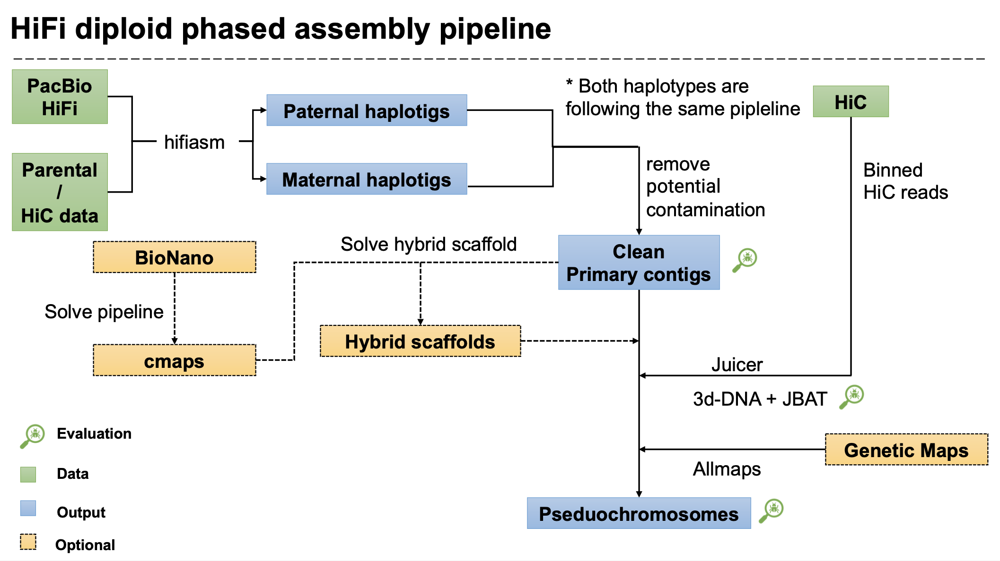
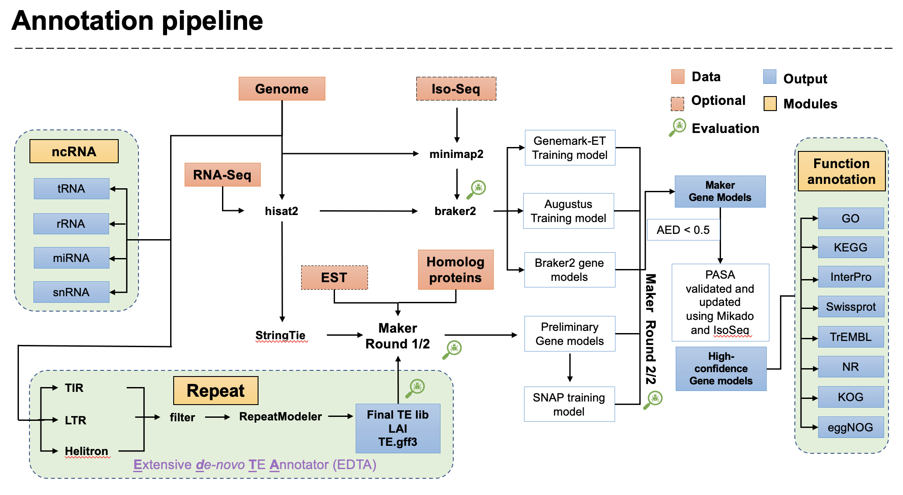

# Snakemake workflow: plant genome HiFi assembly and genome annotation

This Snakemake pipeline aims for plant genome assembly with HiFi data and genome annotation with RNA-Seq/IsoSeq.

## Assembly

Modified from the VGP assembly [VGP tutorial](https://training.galaxyproject.org/training-material/topics/assembly/tutorials/vgp_genome_assembly/tutorial.html)

## Annotation

- Maker running inside snakemake still have problem since the NSF lock and submit system already included.
- IsoSeq intergation still in development. For diploid or polyploidy, FLNC mapping is better than the clustering of PacBio pipeline if you have haplotype-resloved assembly.

